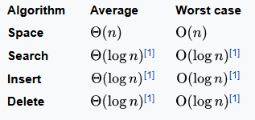

# Tổng quan
- AVL Tree là cấu trúc dữ liệu dạng cây nhị phân tự cân bằng
- Được phát minh vào năm 1962 bởi Georgy **A**delson-**V**elsky và Evgenii **L**andis
  

### Độ cao của một Node
Mỗi Node trong cây đều có thuộc tính chiều cao (H), dùng để ước lượng hệ số cân bằng của Node đó, cách tính chiều cao của một Node như sau
- Node lá: H(leaf) = 0
- Node bất kì không phải lá: H(u) = max(H(u.left), H(u.right)) + 1

### Hệ số cân bằng
Hệ số cân bằng của cây T là hiệu số giữa các chiều cao của cây con trái và cây con phải của nó. Ký hiệu hệ số cân bằng của cây con gôc u là balance(u). Hệ số cân bằng của cây T là balance(T).
balance(u) = height(u.right)-height(u.left)
- Nếu balance(u) > 0, nghĩa là cây con phải cao hơn cây con trái T được gọi là cây lệch phải
- Nếu balance(u) < 0, nghĩa là cây con trái cao hơn cây con phải T được gọi là cây lệch trái
  
**Cây nhị phân được coi là cây AVL nếu tại mỗi nút u của nó hệ số cân bằng có trị số tuyệt đối không vượt quá 1**. Điều đó cũng có nghĩa là với mọi nút u của T, balance(u) chỉ nhận một trong ba giá trị -1, 0, 1

# Thao tác
## Tìm kiếm và Duyệt cây
Giống với cây nhị phân

## Chèn
Xét Node mới được chèn là v có Node parent là u, ta có thao tác chèn như sau:
- Thực hiện chèn giống như cây nhị phân
- Nếu v làm tăng nhiều cao của u, thực hiện xoay để cân bằng cây. Có 4 trường hợp xoay
  - Trước khi chèn cây con gốc u lệch trái và v làm tăng chiều cao của cây con trái. 
    - Sau khi chèn cây con trái lệch trái (Case LL)
    - Sau khi chèn cây con trái lệch phải (Case LR)
  - Trước khi chèn cây con gốc u lệch phải và v làm tăng chiều cao của cây con phải. 
    - Sau khi chèn cây con phải lệch phải (Case RR)
    - Sau khi chèn cây con phải lệch trái (Case RL)

